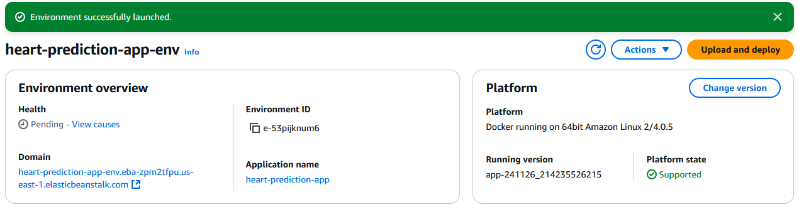

# ❤️ Heart Disease Prediction Project

This project focuses on predicting heart disease using machine learning models. It includes data cleaning, exploratory data analysis (EDA), feature importance analysis, model selection, parameter tuning, and deployment via a web service. The solution is designed for effective containerization and deployment.

---

## 🗂️ Table of Contents
1. [📌 Project Overview](#-project-overview)
2. [📁 Directory Structure](#-directory-structure)
3. [❓ Problem Description](#-problem-description)
4. [⚙️ Installation and Setup](#️-installation-and-setup)
5. [▶️ Running the Project](#️-running-the-project)
6. [🚀 Local Model Deployment](#-local-model-deployment)
7. [🐳 Docker Containerization](#-docker-containerization)
8. [☁️ AWS Elastic Beanstalk Deployment](#️-aws-elastic-beanstalk-deployment)
9. [🧪 Testing the Application](#-testing-the-application)
10. [🤝 Contributing](#-contributing)
11. [📜 License](#-license)

---

## 📌 Project Overview

Heart disease remains one of the leading causes of death globally. This project leverages machine learning techniques to predict the likelihood of heart disease based on patient data. 

Key features include:
- 🧹 Data preparation and cleaning.  
- 🔍 Exploratory Data Analysis (EDA) to uncover patterns and relationships.  
- 🧠 Model training, evaluation, and parameter optimization.  
- 🌐 Deployment via Flask and containerization using Docker for scalable web service hosting. 
- ☁️ Cloud deployment using AWS Elastic Beanstalk.  

---

## 📁 Directory Structure

```plaintext
Heart-Disease-App/
│
├── data/                          # Contains the dataset
├── images/                        # Illustrations and deployment screenshots
├── midterm_project.ipynb          # Jupyter Notebook with data preparation, analysis and model planning
├── train.py                       # Script for training and saving the model
├── predict.py                     # Web service for serving the model
├── no_app_predict_test.py         # Test script for direct model testing
├── predict_test.py                # Script for testing the web service
├── predict_test_cloud.py          # Script for testing the app deployed on AWS Elastic Beanstalk
├── Pipfile                        # Dependencies for pipenv
├── Pipfile.lock                   # Locked versions of dependencies
├── Dockerfile                     # Docker configuration for containerization
├── LICENSE.txt                    # Project MIT License
└── README.md                      # Project description and instructions
```

---

## ❓ Problem Description

**Cardiovascular diseases** are a major global health challenge. This project aims to use machine learning to:
- ⚠️ Identify individuals at risk of heart disease.  
- 🩺 Assist healthcare professionals in making informed decisions.  
- 🌍 Provide an easily deployable service for real-world applications.  

### Heart Disease Prediction Dataset 📊
[The dataset](https://www.kaggle.com/datasets/mfarhaannazirkhan/heart-dataset/data) combines five publicly available heart disease datasets, with a total of 2181  records:

<ul>
    <li> 📝 Heart Attack Analysis & Prediction Dataset: 304 reccords from Rahman, 2021</li>
    <li> 📝 Heart Disease Dataset: 1,026 records from Lapp, 2019</li>
    <li> 📝 Heart Attack Prediction (Dataset 3): 295 records from Damarla, 2020</li>
    <li> 📝 Heart Attack Prediction (Dataset 4): 271 records from Anand, 2018</li>
    <li> 📝 Heart CSV Dataset: 290 records from Nandal, 2022</li>
</ul>

Merging these datasets provides a more robust foundation for training machine learning models aimed at early detection and prevention of heart disease. The [resulting dataset](/data/raw_merged_heart_dataset.csv) contains anonymized patient records with various features, such as age, cholesterol levels, and blood pressure, which are crucial for predicting heart attack and stroke risks, covering both medical and demographic factors.


### Features Description:
<ul>
    <li><strong>age</strong>: age of the patient 
        [years: Numeric]</li>
    <li><strong>sex</strong>: gender of the patient 
        [1: Male, 0: Female]</li>
    <li><strong>cp</strong>: chest pain type 
        [0: Typical Angina, 1: Atypical Angina, 2: Non-Anginal Pain, 3: Asymptomatic]</li>
    <li><strong>trestbps</strong>: resting blood pressure 
        [mm Hg: Numeric]</li>
    <li><strong>chol</strong>: serum cholesterol level 
        [mg/dl: Numeric]</li>
    <li><strong>fbs</strong>: fasting blood sugar 
        [1: if fasting blood sugar > 120 mg/dl, 0: otherwise]</li>
    <li><strong>restecg</strong>: resting electrocardiographic results 
        [0: Normal, 1: having ST-T wave abnormality (T wave inversions and/or ST elevation or depression of > 0.05 mV), 2: showing probable or definite left ventricular hypertrophy by Estes' criteria]</li>
    <li><strong>thalach</strong>: maximum heart rate achieved 
        [Numeric value between 60 and 202]</li>
    <li><strong>exang</strong>: exercise-induced angina 
        [1: Yes, 0: No]</li>
    <li><strong>oldpeak</strong>: ST depression induced by exercise relative to rest 
        [Numeric value measured in depression]</li>
    <li><strong>slope</strong>: slope of the peak exercise ST segment 
        [0: Upsloping, 1: Flat, 2: Downsloping]</li>
    <li><strong>ca</strong>: number (0-3) of major vessels (arteries, veins, and capillaries) colored by fluoroscopy 
        [0, 1, 2, 3] </li>
    <li><strong>thal</strong>: Thalassemia types 
        [1: Normal, 2: Fixed defect, 3: Reversible defect]</li>
    <li><strong>target</strong>: outcome variable for heart attack risk 
        [1: disease or more chance of heart attack, 0: normal or less chance of heart attack]</li>
</ul>

---

## ⚙️ Installation and Setup

**Requirements**: Python 3.11, Ubuntu with WSL 2.0   

### a. Clone the Repository
```bash
git clone https://github.com/maxim-eyengue/Heart-Disease-App.git
cd Heart-Disease-App
```

### b. Install Dependencies
Use `pipenv` to manage dependencies:
```bash
pip install pipenv
pipenv install flask scikit-learn==1.5.1 gunicorn
```

### c. Create and Activate the Environment
```bash
pipenv shell
```

NB: You can also directly use:
```bash
pipenv run `add the command to execute`
```

---

## ▶️ Running the Project

### i. 🏋️‍♂️ Training the Model
Train the model and save it as a binary file:
```bash
python train.py
```

### ii. 🌐 Running the Web Service
Start the Flask application:
```bash
gunicorn --bind 0.0.0.0:9696 predict:app
```

### iii. ✅ Testing the Web Service
Send a test request using `predict_test.py`:
```bash
python predict_test.py
```


---

## 🚀 Local Model Deployment

The model is deployed using Flask in an environment created with pipenv.

Serve the app using Flask and test its functionality:
   ```bash
   python predict_test.py
   ```


You can now transition to containerized deployment with Docker.

---

## 🐳 Docker Containerization

### a. Build the Docker Image
Create a Docker image for the project:
```bash
docker build -t heart-prediction-app .
```

### b. Run the Docker Container
Run the image and map the port:
```bash
docker run -it --rm -p 9696:9696 heart-prediction-app
```

### c. Test the Application
Send a request to the service using:
```bash
python predict_test.py
```


---

## ☁️ AWS Elastic Beanstalk Deployment

### 1. Install AWS Elastic Beanstalk CLI
Install the AWS Elastic Beanstalk CLI in your environment:
```bash
pipenv install awsebcli --dev
```

### 2. Initialize the Application
After activating the environment with `pipenv shell`, initialize the project for Elastic Beanstalk:
```bash
eb init -p docker -r us-east-1 heart-prediction-app
```
If errors occur, use:
```bash
eb init -p "Docker running on 64bit Amazon Linux 2" heart-prediction-app -r us-east-1
```
Provide your AWS credentials when prompted. These can be generated from the AWS IAM service.

NB: You can follow [Alexey's tutorial](https://mlbookcamp.com/article/aws) to create an account on AWS.

### 3. Deploy Locally
Deploy the application locally:
```bash
eb local run --port 9696
```

Use `python predict_test.py` to send a request to the locally running app for testing.


### 4. Deploy to the Cloud
Deploy the application to Elastic Beanstalk:
```bash
eb create heart-prediction-app-env --enable-spot
```

After deployment, the app was accessible at the [Elastic Beanstalk URL](http://heart-prediction-app-env.eba-zpm2tfpu.us-east-1.elasticbeanstalk.com/predict).

To test the deployment, we used:
```bash
python predict_test_cloud.py
```

### 5. Terminate the Service
To terminate the Elastic Beanstalk environment:
```bash
eb terminate heart-prediction-app-env
```

---

## 🧪 Testing the Application

Note that we tested the model in the following ways:

i. 🔬 **Without Flask**: Directly test the model using:
   ```bash
   python no_app_predict_test.py
   ```
ii. 🌐 **Flask Web Service, Docker & Local EB**: Send requests to the Flask app, or to the docker image, or when running Elastic Beanstalk locally:
   ```bash
   python predict_test.py
   ```
iii. ☁️ **Cloud Deployment**: Test the application on AWS:
   ```bash
   python predict_test_cloud.py
   ```

---

## 🤝 Contributing

We welcome contributions to enhance this project. Please:
- Fork the repository.
- Create a new branch for your feature or bug fix.
- Submit a pull request with a detailed description of your changes.

## 📜 License

This project is licensed under the [MIT License](LICENSE.txt).

--- 


;) We will miss you...
---
